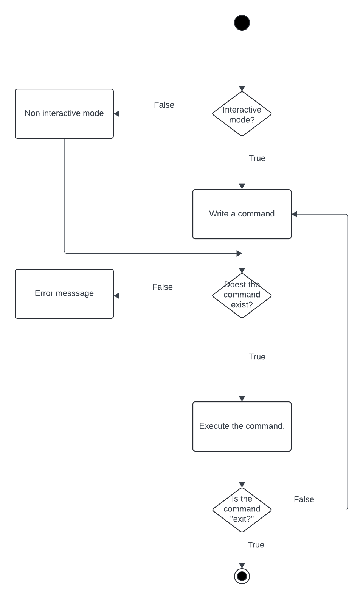
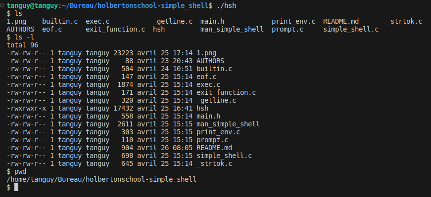

## Simple Shell
#### Simplified version of a shell in C langage

## Project description
This is a group project. We had to recreate a simplified version of a shell

## Activity Diagram (UML) : How does it work ?



## LIBRARIES USED & GCC Version
`stdlib.h` | `stdio.h` | `unistd.h` | `string.h` | `sys/types.h` | `sys/wait.h` | `sys/stat.h` |

gcc --version (Ubuntu 11.4.0-1ubuntu1~22.04) 11.4.0

## Simple Shell : How to use it?

Git clone from this repository (HTTPS):
```
https://github.com/TanguyMoreau99/holbertonschool-simple_shell.git
```

Compile with this command :
```
gcc -Wall -Werror -Wextra -pedantic -std=gnu89 *.c -o hsh
```

Run the program by typing :
```
./hsh
```

For a better use of the program, we advice you to RTFM by running
```
man  ./man_simple_shell
```

## Examples



## Authors
<a href="AUTHORS">File Authors<a>

